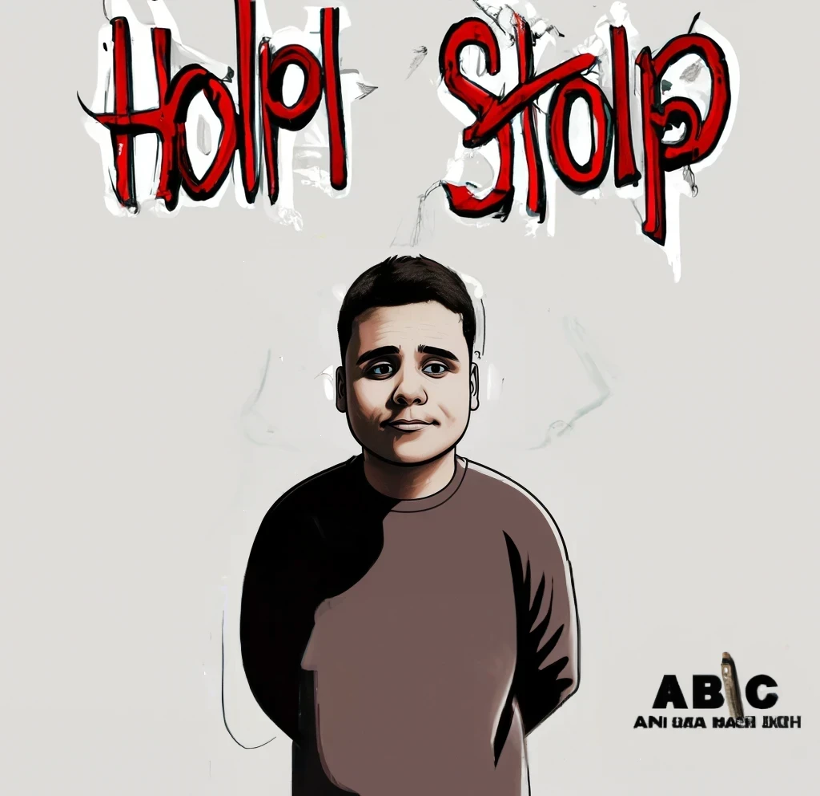

# nachotron-voice

Project testing the generation of a dataset and clone the voice of Nach (a god of Spanish rap) using a GAN.

## Examples

* [Poem generated using ChatGPT and readed by Nachotron :point_left:](https://github.com/pablomm/nachotron-voice/raw/main/docs/nachotron_chatgpt_poem.mp3)
* [*Esclavos del destino* singed by Nachotron	:point_left:](https://github.com/pablomm/nachotron-voice/raw/main/docs/nachotron_esclavos_del_destino.mp3)

  

## Aknowlegments

 

